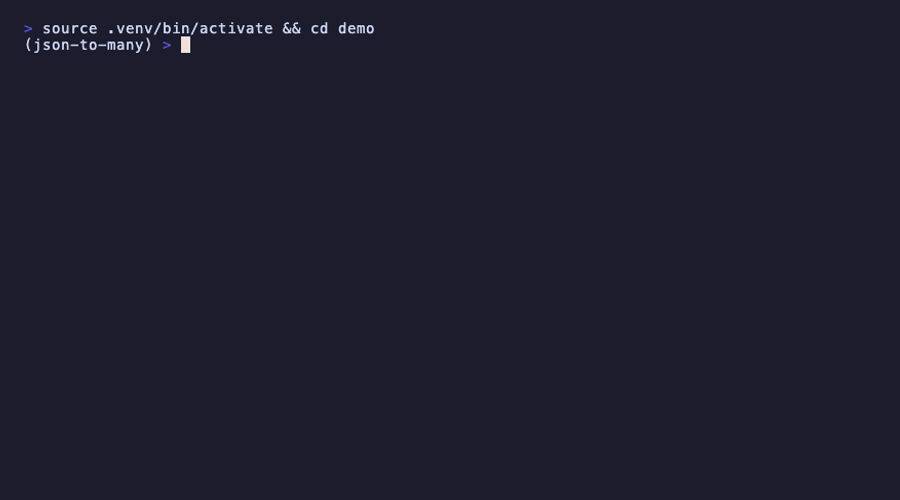

# Json2Many

[](https://pypi.org/project/json_to_many/)
[](https://github.com/ananthanandanan/Json_To_Many/blob/main/LICENSE)

A zero-dependency Python library and CLI for converting JSON into multiple output formats.
Every conversion returns a typed `ConversionResult` — no raw string parsing, full mypy/pyright
support out of the box.

→ **[User Guide](docs/GUIDE.md)** — scenario-driven walkthrough of every feature



---

## Installation

```bash
# Library only
pip install json_to_many

# With CLI support
pip install 'json_to_many[cli]'
```

## Quick Start

**Library:**

```python
from json_to_many import convert

result = convert("users.json", "csv", delimiter=";")
print(result.data)
# id,name,email,score,city
# 1,Alice Nguyen,alice@example.com,8.4,London
# 2,Bob Smith,bob@example.com,7.1,Berlin
print(result.stats.rows)    # 5
```

`convert()` also accepts Pydantic-style models with `model_dump()` and dataclass instances:

```python
from dataclasses import dataclass

@dataclass
class User:
    id: int
    name: str

result = convert(User(id=1, name="Alice"), "csv")
```

**CLI:**

```bash
# Inspect a JSON file before converting
json2many schema api_export.json

# Convert to CSV
json2many convert api_export.json --to csv --output report.csv

# Multiple formats in one pass
json2many convert api_export.json --to csv --to html --output-dir ./dist/
```

---

## Formats

| Format | When to use | Options |
|--------|-------------|---------|
| `markdown` | Docs, wikis, changelogs | `title`, `heading_offset`, `max_heading_level`, `bullet_lists`, `table_for_lists`, `frontmatter`, `code_block_keys` |
| `xml` | Legacy system integration, data exchange | `root_element`, `item_element`, `pretty_print` |
| `csv` | Spreadsheets, analyst handoff | `delimiter`, `quotechar`, `include_header`, `columns` |
| `html` | Stakeholder reports, CI build artifacts | `title`, `table_style`, `wrap_in_page` |
| `jsonl` | Log pipelines, ML fine-tuning, streaming | `ensure_ascii` |
| `sql` | Database seeding, fixture data for tests | `table`, `include_create`, `batch_size` |

---

## Project Config

Add `.json2many.toml` at your project root to share converter settings across a team:

```toml
[converters.csv]
delimiter = ";"

[converters.xml]
pretty_print = true
root_element = "records"
```

Explicit options always override the config file. See the [User Guide](docs/GUIDE.md) for the
full priority order and all supported keys.

---

## Development

```bash
uv sync --extra cli --dev       # install runtime, CLI, and dev tooling
uv run pre-commit install       # install Git hooks
uv run pre-commit run --all-files
uv run pytest
```

The pre-commit setup runs Ruff lint fixes, Ruff formatting, YAML validation, trailing whitespace
cleanup, and final newline checks. Ruff is pinned through both `pyproject.toml` and
`.pre-commit-config.yaml`; keep those versions aligned when upgrading the formatter.

> **Maintainers:** See [RELEASING.md](RELEASING.md) for the release process.

## License

MIT — see [LICENSE](LICENSE).
